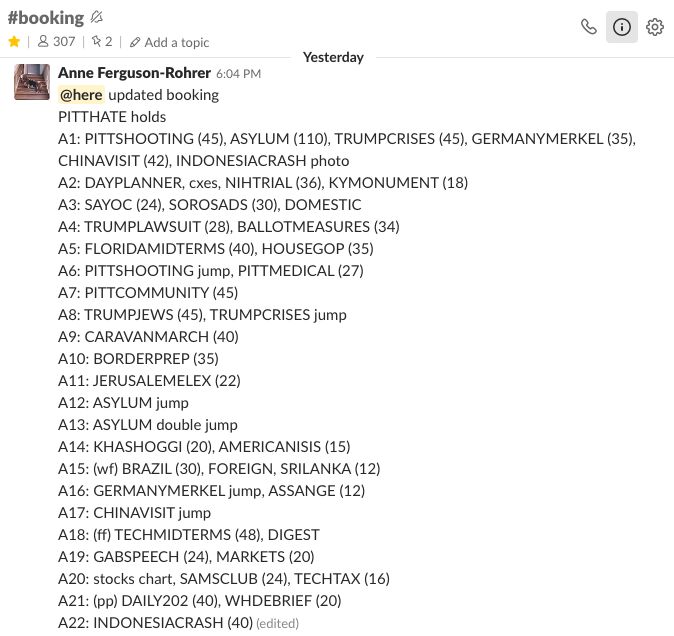
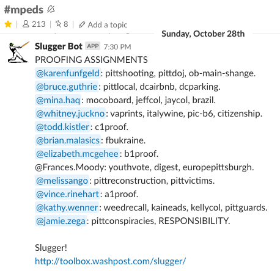
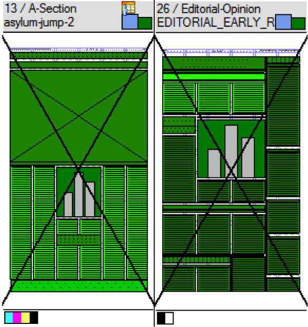
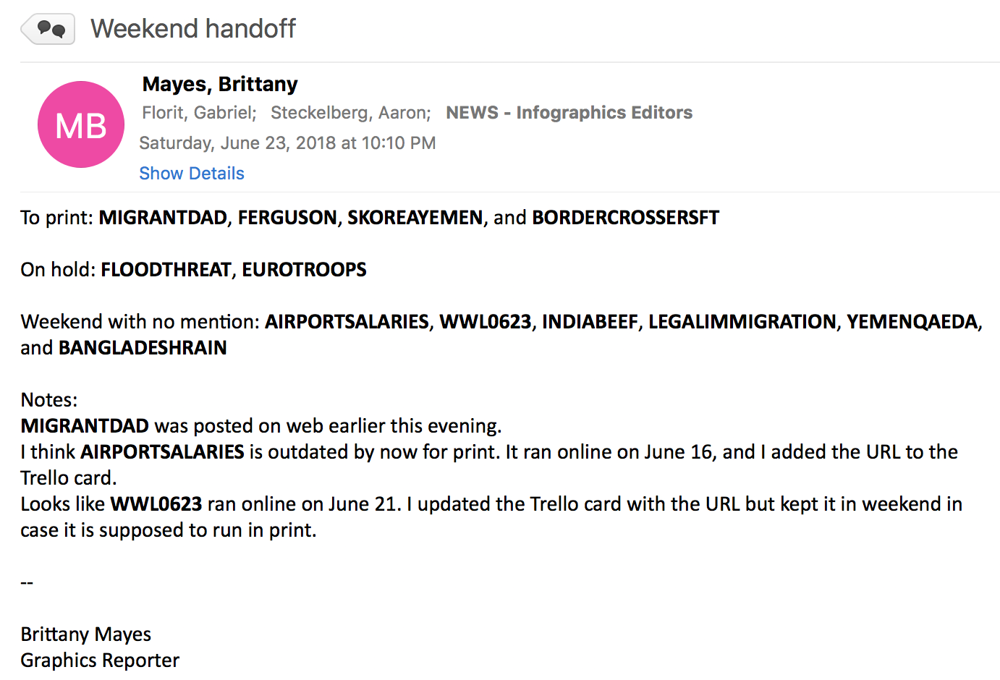

# nightshift-docs
Documentation for how to work the night shift! 🌚

# So you're on the night shift...
#### What's the night shift?
The night shift is meant to keep graphics staffed later in the day in case of breaking news. The person on the night shift is also responsible for making sure graphics published get online and to print successfully.

#### Getting started
The shift hours are from 2:30 to 10:30 pm, but those times are squishy. Aim to be at the office no later than 3:30 pm because generally, it's a good idea to monitor slack until around 11:30 pm (even if you've already commuted home).

**First things first:** When you get into the office, it's a good idea to announce yourself when you get into the office so folks know who is on duty. In `booking` and `mpeds` drop a line saying you're in office and you're on the night shift. Do this _especially_ if you're filling in for someone.  

After that, check with Tim (or another editor) if you're working a weekday. On the weekend, check in with the person on the day shift. The day shifter goes to the 1 pm meeting and will usually have already communicated with the editor on call.

Either the editors or the person on the day shift will know what's running in the paper the next day. Booking for the paper changes often so sometimes, they won't. We'll get to that.

**Once you have a better grasp on what's happening**, knock a few quick things out:
  1. Schedule a tweet using [Social Flow](https://www.socialflow.com/publish#) for between 3:30 and 4 pm.
      * You can set it to `Optimize` and `Must send` within 30 minutes. Chances are, the twitter has gone stale _especially_ if it's the weekend. Send a single tweet out just to give yourself 2 more hours time to get things done. Use Social Flow's default option to shorten the url, whether or not it's already shortened, to enable tracking. To include images in your tweets, take a screenshot from your Macbook.

  2. Update the homepage in [PageBuilder](https://washpost.arcpublishing.com/pb/admin/app/browse/pages.html).
      * Type "Visual" into the search bar. Click on `Visual Stories - for Homepage`. We have slots 2 and 3. Open [Trello](https://trello.com/b/loxfgmVV/graphics-docket) and look at the column "Flag for Viz Slots." So, you can update the slots in two ways:
        * **Option 1.** If the slots are filled with content that is still very relevant _or_ we just don't have that much to choose from in trello, look at the sidebar for `main-content`. Hover over the three line icon and swap our two slots. Super simple. Then `preview commit > stage and publish` (so long as everything looks right).
        * **Option 2:** Choose a slot to edit by hovering over it and clicking the ✏️ icon. Go to trello and find a project to update with. Grab the URL and throw it in the [Graphics App to Methode Finder](http://newsapps.washpost.com/modlib/graphics-finder/). You need the **Methode URL**. Once you have that, add go back to PageBuilder and look for the `Path` field. Paste the Methode URL. Press update (this won't update the homepage yet). Navigate back to the page editor then same thing—`preview commit > stage and publish`.

**You're representing graphics.** On weekdays, the booking meeting is at 4 pm. The editors usually go to this. If it's the weekend, you need to attend the 5 o'clock meeting. Tim Curren runs the meeting. Everyone is asked how they like the front page and walked through the other section fronts. People will generally just agree that it looks good. Then, at the end, they'll go through things they're thinking for Monday's paper. Take notes. Ask about graphics if you need to.

#### Taking care of print graphics
It's always good to take the list of graphics you got from the editors or day shifter with a grain of salt. Booking changes all the time so do some investigating of your own. Scan trello for slugs then check the following places to get a better idea of what's running (hopefully, it's what you already know about). Places to look:
1. [Methode](https://methode.washpost.com/vpn/index.html): Dense, but the best place to start.
    * **Method 1:** Check the paper layout `File > Quick Open > WP-YYYYMMDD-Daily.prp`. It's always the last file in the list and don't foget to always check **read only**. Use the `+` to navigate to the different sections and try to find anything with a chart symbol in place. Those have about a 66% of being from our team. Right click and open read only to investigate further.
    * **Method 2:** Check the topic plan `Topics > Browse Topic Plans`. You can easily see all the slugs that _could_ run. You should do both to keep all your bases covered.
2. `#booking` and `#mpeds` channels in slack: These channels will be your best friends on the night shift, and they often overlap with the same content. Booking is run by the editors and designers. Look for the print booking for the day. It'll look something like this:

    MPEds has the copy editors. Look for the proofing assignments. It'll look something like this:

    **Important note:** Booking only talks about the A section. Graphics can and do run in any of the sections. Keep an eye out in MPEds for a better picture of what will run in the rest of the paper.
3. [Slugger](http://toolbox.washpost.com/slugger/): This has all the MPEd assignments for the paper. Doing this is a repeat of looking at the proofing assingments, but it's a bit easier to see the status of stories on Slugger. Do a quick scan to find out both who is editing the stories you have graphics for to find out if there are things booked with matching graphic slugs that you didn't know about.

For each graphic, you'll need to:
1. Send to the MPEd for the story. You'll find them in `#mpeds` or on Slugger. Even if it's explicitly mentioned to have been copy edited on the Trello card, the MPEds want to see it before it goes to print. Also send to MPEds every time there's an update made or it runs again. Just send a nice little message with a screengrab over Slack. They'll request if they want to review the graphic sent in a different way. Generally, they don't. Make the changes and upload to Methode.
2. Check for rich black. Open the file (they could be in Methode, they could be in Dropbox. Sometimes, it's a mystery!)  You can check by selecting black text then going to `Select > Same > Fill and Stroke`. Then you'll be able to quickly see what the graphic is using. Another awesome shortcut is to open the `Separations Preview` panel. It's really easy to see what's on each printer plate that way.
3. Check the print layout to make sure **1.** the graphic isn't cut off and **2.** the graphic is in the right colorscale. Same way as before, `File > Quick Open > WP-YYYYMMDD-Daily.prp` etc. When you look at the page it's running on from the overview, you can see little boxes that'll indicate whether it's a color or black and white page. If it's in color, you're good. If it's in black and white, you'll have to bring it into illustrator and convert it. To quickly do so, go to `Edit > Edit colors > Convert to greyscale`. You might have to tweak it to make sure it looks good and the colors are differenciated enough.

*Notes:*
* Get all the graphics finished as soon as possible. The first round of the paper usually closes around 8:30pm, so aim for all things being set by 7:30pm.
* [PDF](http://pdf/) is a helpful reference. Once the pages have closed, this'll show a pdf version of each page. You can use it to check how graphics look.

**So what if I see a story that matches a slug that _doesn't_ have a graphic in it?!**

Don't worry. Check in with the designer first. Find them in `#booking` or look in [Skedder](https://newsplan.washpost.com/skedder/) for who is assigned to the section. All else fails, just ask in Slack.

Offer the graphic(s) up to them. They don't _have_ to run it in print, but it's possible they didn't know about it espically if it wasn't in the package. If they want it, you might have to resize it and upload a new print version for them. Always establish the amount of space you have (number of cols and pt. depth).

Chances are, if it's running in print, it's also already run on the web. Another mystery: if that's true. Quite honestly, I just google and check the author's page to see if the story is pubbed. Once you find it, make sure the graphic is in the story. If it's not, add it. If it's in the normal template, just drag and drop to a slot at the bottom (generally the secondary slot, never the primary). If it's in the features template, drag and drop it where you see fit and use the "inline" option. For one column graphics, it should be put in as 296 width, for larger things, use the full with 600.

Don't forget to republish! `Tools > Actions > Check in`, then `Tools > Actions > Publish`.

If you can't get it or you're uncomfortable, just hit up `#homepage` for help.

**Wait, what about...**

**The Twitter?! (Again.)** Go ahead and queue tweets for the next 22 or so hours. That way the twitter won't sorely lapse. Projects *should* have tweets attached to their trello cards. Schedule a tweet for every few hours (ignoring the hours between 10pm and 7am). That's about four or so tweets optimized for 6-8pm, 8-10pm, 8-10am, 11am-1pm. That gives the person on the next night shift time to do a similar queue schedule.

**Dinner?** If there's a bunch in the paper and I've been swamped, I wait until 8:30pm after the first round goes out but that's pretty late. If you've handled everything and things are chill, just have your phone and monitor slack while you grab food. Pretty much only fast food is available nearby after 7pm.

#### Wrapping up

**Most importantly, when can I leave!?** Well, you can head out once a couple of things happen.
1. At minimum, the `RE` has to have gone out. For background, there's three rounds of the paper. The regional (RE), suburban (SU) and metro (M2). You'll see those referenced in slack a bunch in `#booking` and `#mpeds`. The `RE` usually closes around 8:30, the `SU` around 10/10:30 and the `M2` at 11:30 or so.
2. You've sent the night note. This can be done around the first round of the paper getting sent out or right before you leave. Open Trello. The important columns are the `Published / Night note`, `Flag for Viz Slots` and `Watch for updates`. Any graphics that ran on the web that day should be in the night note. Make sure each trello card has at minimum: **1.** a cover photo, the description filled out with **2.** the story title and **3.** the story link. Any extra information can be moved to the comments. Those don't come through the night note. **Important**: make sure there is not a classic apps link in the description! The other columns should _hypothetically_ be fine since they run in the night note every night.
    * **To send the night note**, go to Slack and scroll to your Apps. Search for `graphicsbot`. Send a test to my email. Just type `test` and send. It'll give you feedback and send you a test night note. Check it and make sure all looks good. When you're ready to send, just type `send` and confirm.
3. If it's Saturday, send a weekend passoff note to the person working the weekend day shift, the person working the Sunday night shift (Usually Aaron Steckelberg) and NEWS - Infographics Editors <graphicseds@washpost.com>. Super simple. Here's about what it should look like:

Just include what went into print that day, what is left in the `Weekend` column of the trello and if there are any small notes, include those, too. For example, if someone missed moving a graphic to published, just update the card with the correct information, move it to the bin and make a note so they know.
4. Announce that you're on your way out. Generally just dropping a note in the `#graphics-team` channel saying that graphics is going offline for the evening is all that takes. 

Head home and, if you feel so inclined, stay on call for last minute changes and emergencies.

**When do I fully sign off?** 11:30pm is a safe bet. It's late but it's nice to commute home then take a look at slack one more time before you fully sign off to make sure nothing's exploded. Finally,  call it a night.
